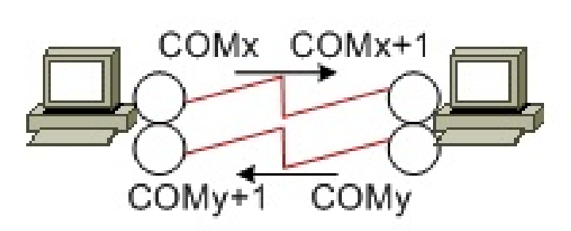

Задание
1. Выбрать ОС (Windows, Linux, другую), язык и среду
   программирования. Учесть, что замена выбранной системы
   программирования при выполнении следующих лабораторных работ
   запрещена.
2. Выбрать эмулятор COM-портов (UART 16550). Можно использовать
   Eterlogic Virtual Serial Ports Emulator. Ознакомиться с возможностями.
3. Создать в эмуляторе топологию, совместимую с показанной на
   рисунке.

Рисунок
4. Написать коммуникационную программу в соответствии с
   требованиями ниже. 

Требования к наполнению программы:
   1. Программа должна передавать и принимать данные через разные
      COM-порты.
   2. Программа должна быть собственно цельной программой
      (отдельным приложением), работающей на передачу и на прием (количество
      потоков и так далее не регламентировано).
   3. COM-порты должно выбирать вручную после запуска программы --
      с возможностью последующей замены.
   4. Данные должны передаваться посимвольно, причем как «сырой
      поток».

Требования к интерфейсу программы:
1. Интерфейс должен состоять из четырех либо пяти окон: окна ввода,
   окна вывода, окна управления, окна состояния и опционального отладочного
   окна.
2. Окна могут быть одного из самых разных стилей (зависит от ОС и
   так далее).
3. Окно ввода, очевидно, необходимо чтобы вводить символы для
   передачи. Должны поддерживаться все печатные символы (буквы, цифры и
   так далее) плюс Enter. Набранный символ должен сразу поступать в канал.
   Программа должна быть постоянно готова к вводу символов (вплоть до
   закрытия).
4. Окно вывода необходимо чтобы выводить принятые символы.
   Принятый символ должен сразу быть отображен. При этом сообщение в окне
   2
   вывода должно полностью совпадать с сообщением в окне ввода программыабонента.
5. Окно управления должно содержать два элемента (только два):
   формы для выбора CОМ-портов (параметры COM-портов должны быть
   фиксированными и одинаковыми для обоих портов).
6. В окно состояния необходимо один раз вывести выбранные значения
   всех доступных параметров инициализации COM-портов в выбранной
   системе, и периодически выводить количество переданных байтов.
7. В опциональное отладочное окно можно выводить отладочную
   информацию («для себя»). 

Требования к отчету:
1. Отчет предоставить на стандартных листах бумаги формата А4
   (можно использовать обе стороны листов, соблюдать общие требования к
   оформлению).
2. Отчет должен состоять из двух частей: теоретической и
   практической.
3. Теоретическая часть. Описать (вручную) параметры инициализации
   COM-портов в выбранной системе, возможные значения этих параметров, а
   также указать выбранные значения.
4. Практическая часть. Переписать (вручную) код программы.
   Переписывать нужно только набранные фрагменты. Если части кода
   сгенерированы автоматически, то их переписывать не нужно; но нужно
   изобразить результат, то есть нарисовать рисунок (можно упрощенно, но
   технически грамотно).

Основные замечания (касаются всех лабораторных работ):
1. Вариантов нет. Задание выполняйте индивидуально.
2. Не смотря на то, что задание учебное, оно отражает требования
   условного заказчика, которые вы должны выполнить. Результаты работы не
   должны противоречить требованиям заказчика -- это нормально. С другой
   стороны, то, что не определил заказчик, но необходимо для выполнения
   задания, вы вольны доопределять по своему усмотрению -- это тоже
   нормально.
3. Для проверки выполнения программу предоставляйте в виде
   исполняемого файла, причем полноценного.
4. Назначение элементов в составе интерфейса должно соответствовать
   общепринятому смыслу. Иначе программа будет отклонена (при проверке
   выполнения). Обратите внимание.
5. Обратите внимание на соразмерность различных форм в составе
   интерфейса.
6. Обратите внимание на поддержку языков.
7. Обратите внимание на обработку ошибок. 