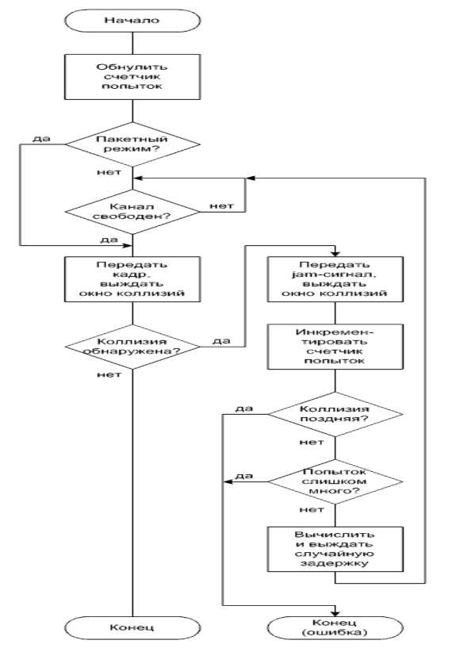
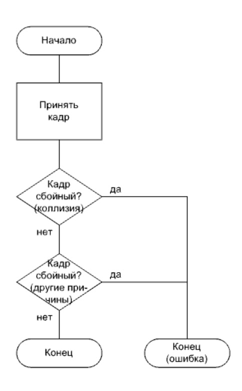

Задание

Дополнить программу пакетной передачи данных через COM-порты
упрощенным алгоритмом CSMA/CD в соответствии с требованиями ниже.

Требования к наполнению программы:
1. Взять за основу программу, относящуюся к лабораторной работе
   №3.
2. На стороне передатчика, реализовать три ключевых шага алгоритма:
   прослушивание канала, обнаружение коллизии и розыгрыш случайной
   задержки (в соответствующей последовательности).
3. Предусмотреть возможность эмуляции занятости канала.
   Вероятность занятости канала должна составлять 70 %.
4. Коллизию рассматривать применительно к каждому биту (байту)
   кадра (всего).
5. Предусмотреть возможность эмуляции коллизии. Вероятность
   коллизии должна составлять 30 %.
6. Для расчета случайной задержки использовать стандартную
   формулу.
7. Из «довесков» к алгоритму, реализовать поддержку jam-сигнала
   (дополнительно и правильно; как на стороне передатчика, так и на стороне
   приемника).

   Требования к интерфейсу программы:

1. Модифицировать окно состояния. По-прежнему периодически
   выводить количество порций переданных символов и структуру текущего
   кадра перед передачей. При этом, после поля FCS через еще один пробел
   выводить информацию о коллизиях. Факт отсутствия коллизий при передаче
   текущего бита отображать выводом символа '.'. Факт возникновения
   коллизии (отдельно взятой) при передаче текущего бита отображать выводом
   символа '!'. Символы, относящиеся к одному биту дописывать слитно.
   Символы, относящиеся к разным битам (в рамках порции, без привязки к
   кадрам) дописывать через пробелы.

   Требования к отчету:

1. Отчет оформлять по аналогии с отчетом по первой лабораторной
   работе.
2. Теоретическая часть. Не нужна.
3. Практическая часть. Переписать (вручную) изменения и дополнения кода программы. 

Передатчик

Приемник

